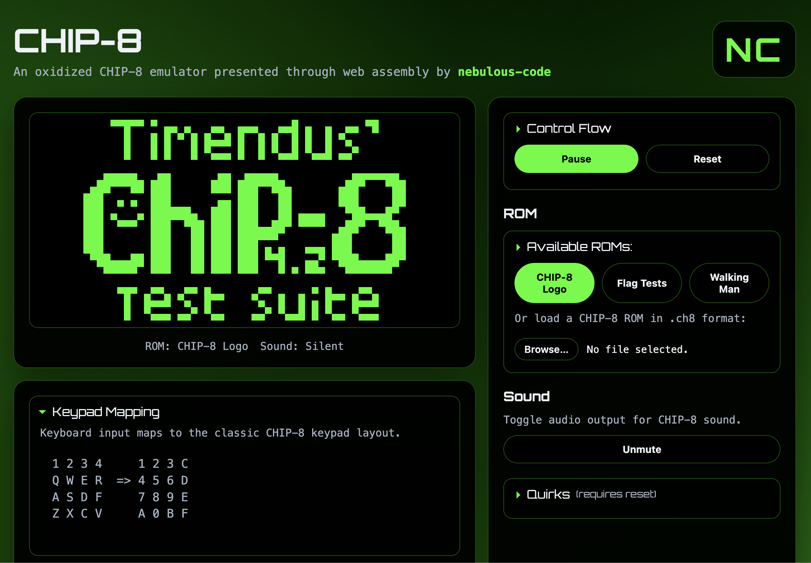
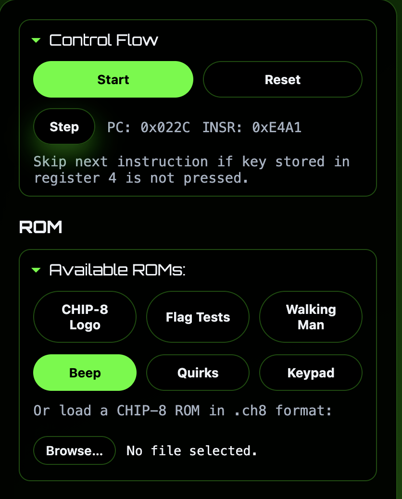
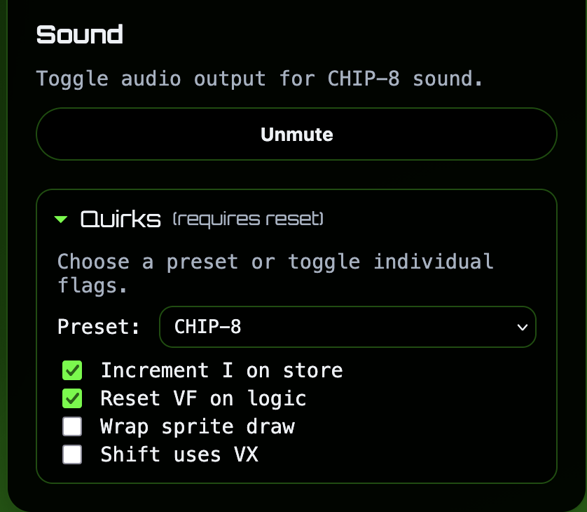
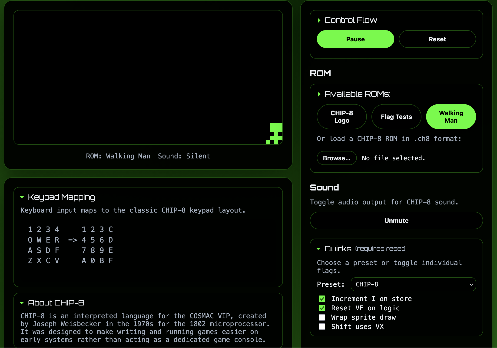
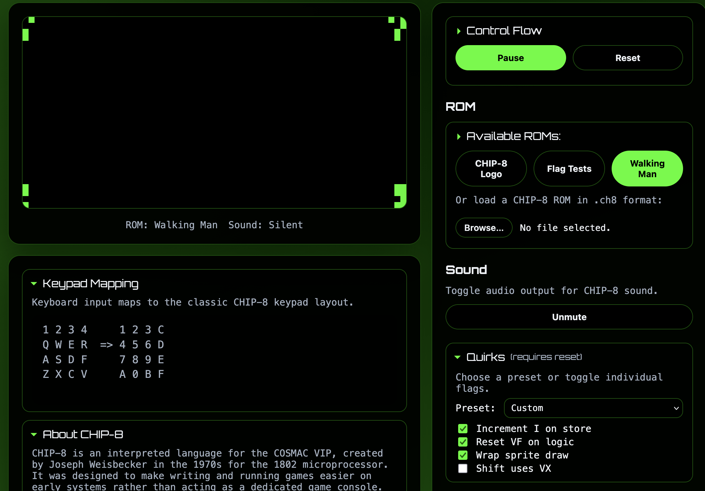

# CHIP-8 Vue

CHIP-8 Vue is a web app for playing CHIP-8 ROMs in the browser. It focuses on
a clean screen, simple controls, and quick ROM loading.

## Live demo
https://nebulous-code.github.io/chip8-vue/

## Showcase

Special thanks to [Timendus' CHIP-8 Test Suite](https://github.com/Timendus/chip8-test-suite)

Manage the program counter manually and see a description about the next command.

Configure quirks and mute the CHIP-8

Sprite wrapping is configurable with the quirk setting.

Sprite wrapping enabled with the quirk.

## Using the App

### ROMs

- Available ROMs are listed at the top of the ROMs section.
- Click a ROM button to load it.
- To load a local ROM, use the upload button and select a `.ch8` file.
- When a ROM is loaded, the app highlights the active ROM source.

### Control Flow

- Start begins running the ROM.
- Pause stops execution without clearing the screen.
- Reset restarts the current ROM from the beginning.
- Step runs a single instruction at a time (available when paused).
- When the Control Flow section is expanded, the app shows:
  - Program Counter (PC)
  - Current instruction (INSR)
  - Instruction description

### Sound

- The Sound line shows `Beep` or `Silent` based on the CHIP-8 sound timer.
- Use the mute toggle to disable audio output.

### Quirks

Quirks adjust small compatibility behaviors used by different CHIP-8 variants.

- The Quirks section includes a preset selector.
  - Some advanced CHIP-8 variants do not have necessary quirks enabled.
- Changing a quirk does not affect the current ROM until Reset is pressed.

### Keypad Mapping

CHIP-8 uses a 4x4 keypad. This app maps it to the first 16 keys on a QWERTY
keyboard:

| CHIP-8 | Keyboard |
| --- | --- |
| 1 2 3 C | 1 2 3 4 |
| 4 5 6 D | Q W E R |
| 7 8 9 E | A S D F |
| A 0 B F | Z X C V |

### About CHIP-8

The About section includes a short overview of what CHIP-8 is and why it
exists. Use it for quick context if the system is new.

## CHIP-8 Library

This app is powered by the Rust CHIP-8 emulator by nebulous-code.

- Repo: https://github.com/nebulous-code/chip-8
- chip8sys crate (v0.1.0): https://crates.io/crates/chip8sys
- chip8wasm crate (v0.1.0): https://crates.io/crates/chip8wasm

## Advanced: Updating the App and WASM Integration

This app uses a Rust-built WebAssembly package generated by wasm-bindgen.
The Vue client talks to that package through a small TypeScript wrapper.

### Key Files

- `chip8/chip8wasm/src/lib.rs` defines the wasm-bindgen exports.
- `chip8/chip8wasm/pkg` is the generated WebAssembly package.
- `chip8-vue/src/wasm/chip8Client.ts` is the TypeScript wrapper and interface.
- `chip8-vue/src/App.vue` is the UI that calls the wrapper.

### Repo Layout Differences (Local vs GitHub Actions)

- Local development expects the Rust repo to be a sibling folder:
  `../chip8/chip8wasm/pkg`
- GitHub Actions checks out the Rust repo inside the Vue project:
  `./chip8/chip8wasm/pkg`
- `vite.config.ts` allows both paths so the same build works locally and in CI.

### Rebuilding the WASM Package

1) Build the WASM package from the Rust workspace:
   - `wasm-pack build --target web` (run inside `chip8/chip8wasm`)
2) Restart the Vite dev server.
3) Hard refresh the browser so the new WASM bundle loads.

### How the Pieces Fit Together

- The Rust crate exports methods such as `tick`, `framebuffer`, and `programCounter`.
- wasm-bindgen generates JS glue in `chip8/chip8wasm/pkg`.
- The Vue app imports the package as a local file dependency and calls it via `chip8Client.ts`.

## Scripts

- `npm install`
- `npm run dev`
- `npm run build`
- `npm run preview`
- `npm run typecheck`

## Project Layout

- `index.html` app entry point
- `src/main.ts` Vue bootstrapping
- `src/App.vue` UI shell
- `src/styles.css` app styling
- `src/wasm/chip8Client.ts` WASM client boundary and helpers
